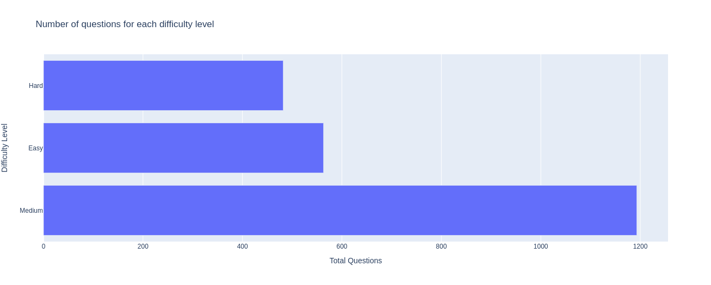
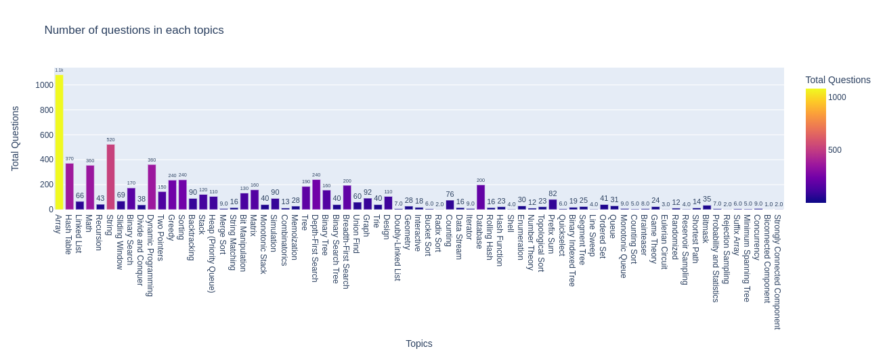
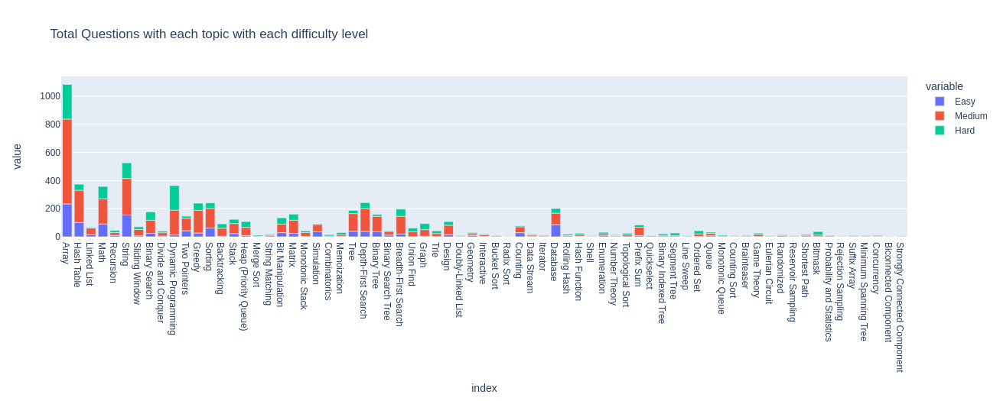
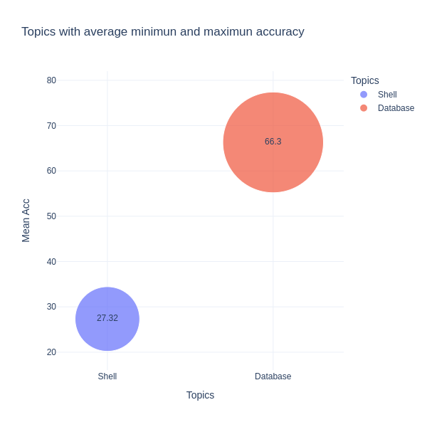
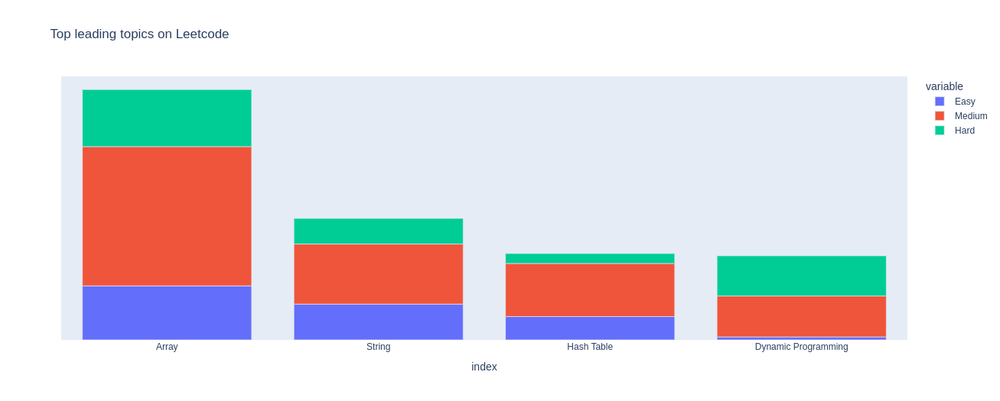

# leetcode-questions-analysis

Scrape Lettcode questions data using GraphQl API.
Analyse questions and topics.
Predict topics to given questions text or description.

### Run:
Scrape all questions data
```sh
python scrape.py
```
Combine data & generate topics file
```sh
python utils/combine_data.py
python utils/create_topics_data.py
```
(All data are already available `data/` folder)

### Run Analysis:
```sh
analysis.ipynb
```
### Predict topics:
```sh
predict-topics.ipynb
```

### Analysis






